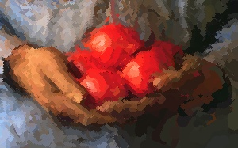

# Painterly
Aaron Hertzmann's algorithm for stroke-based rendering in Python. The algorithm paints a given image using curved brush strokes of given widths.  Its only dependencies are OpenCV and NumPy as seen in requirements.txt.



### Usage
See example.ipynb for an example usage from the command-line or by importing.

From the command-line:
```
python painterly.py IMAGE_FILE [--r RADII][--output OUTPUT_FILENAME][--T APPROX_THRESH][--straight][--f_g GRID_FACTOR]
```
example:
```
python3 painterly.py images/tomato.jpg --r 8 4 2 --output images/tomato_rendered.jpg
```
where you want to use radii 8, 4, and 2 pixels in that order.

Aaron Hertzmann. 1998. Painterly rendering with curved brush strokes of multiple sizes. In _Proceedings of the 25th annual conference on Computer graphics and interactive techniques_ (_SIGGRAPH '98_). Association for Computing Machinery, New York, NY, USA, 453–460. [https://www.mrl.nyu.edu/publications/painterly98/hertzmann-siggraph98.pdf](https://www.mrl.nyu.edu/publications/painterly98/hertzmann-siggraph98.pdf)